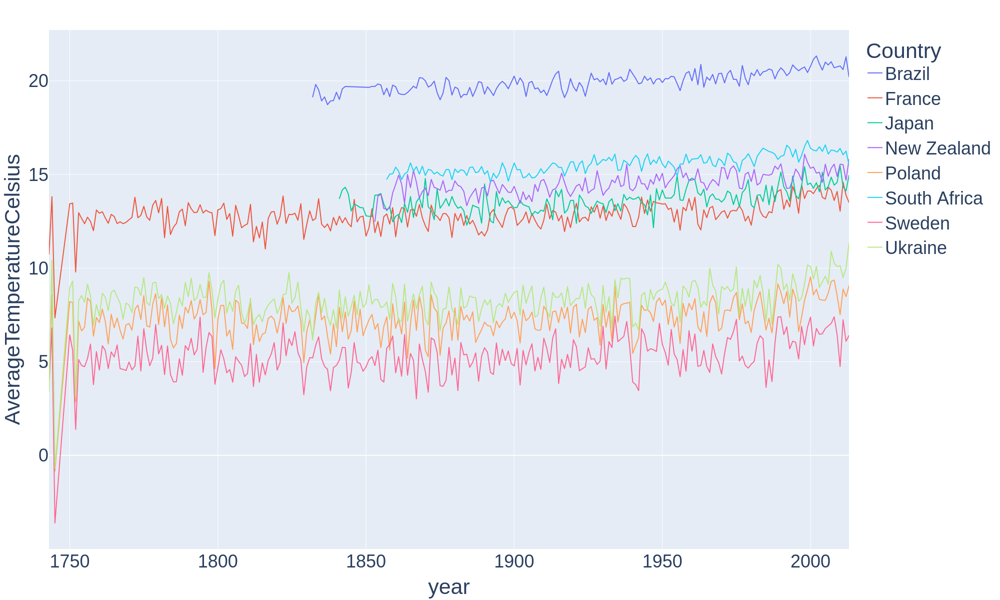

# World Temperature Analysis

## Data
The data come from the [Climate Change: Earth Surface Temperature Data](https://www.kaggle.com/datasets/berkeleyearth/climate-change-earth-surface-temperature-data/data?select=GlobalLandTemperaturesByCity.csv) dataset.

Data were filtered with **overview**&rarr; **scripts** &rarr; **filtering.py**.

## Overview

  

## Forecasting
To see the forecasts with ARIMA, SARIMA, Facebook Prophet, and HWES go to &rarr; **forecasting**.

  

div
