<!-- Bar Charts (Color) -->

  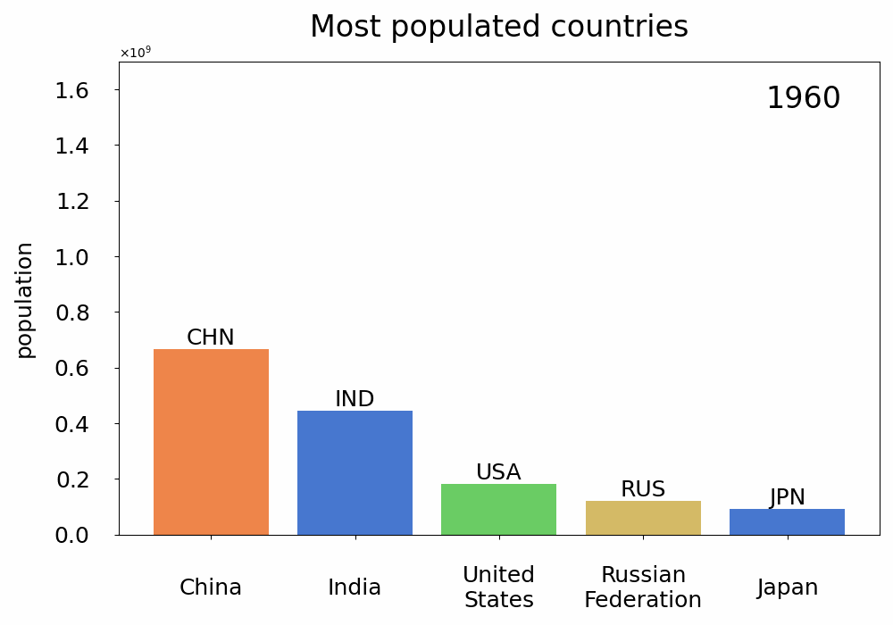
  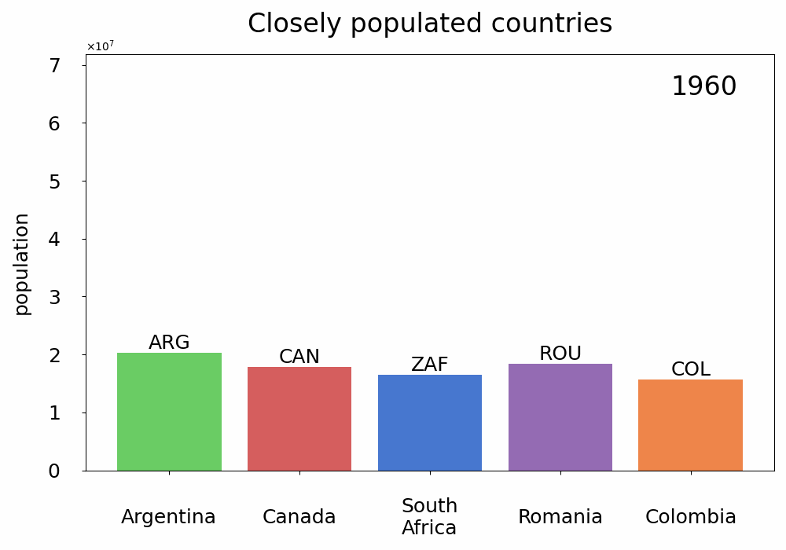
  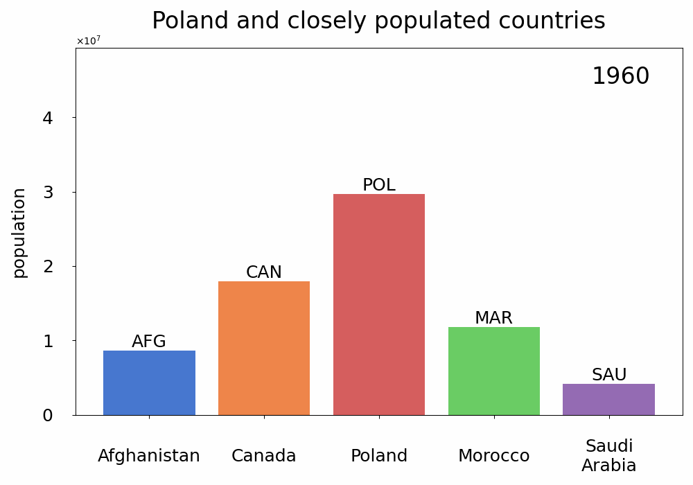

<!-- Bar Charts (Black & White) -->

  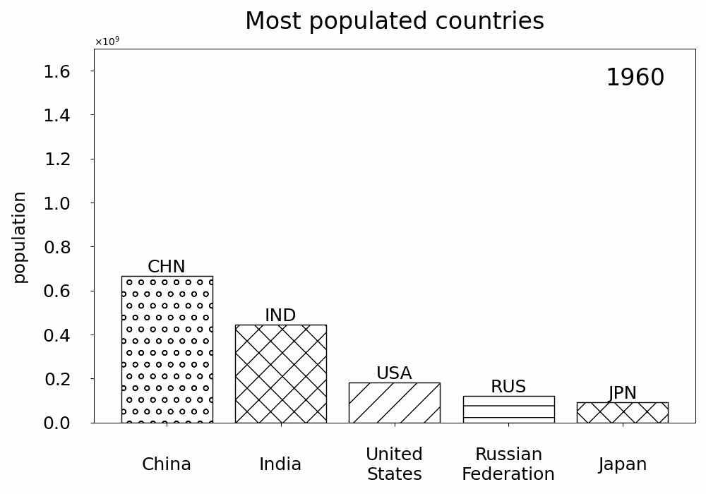
  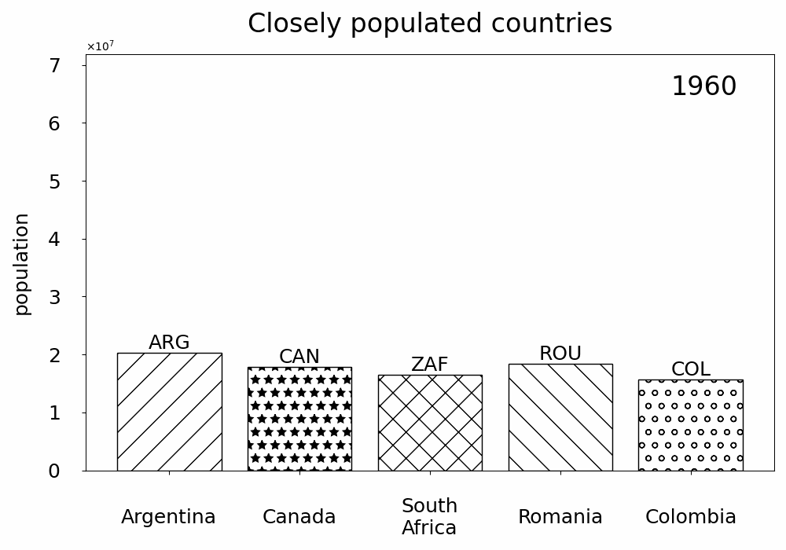
  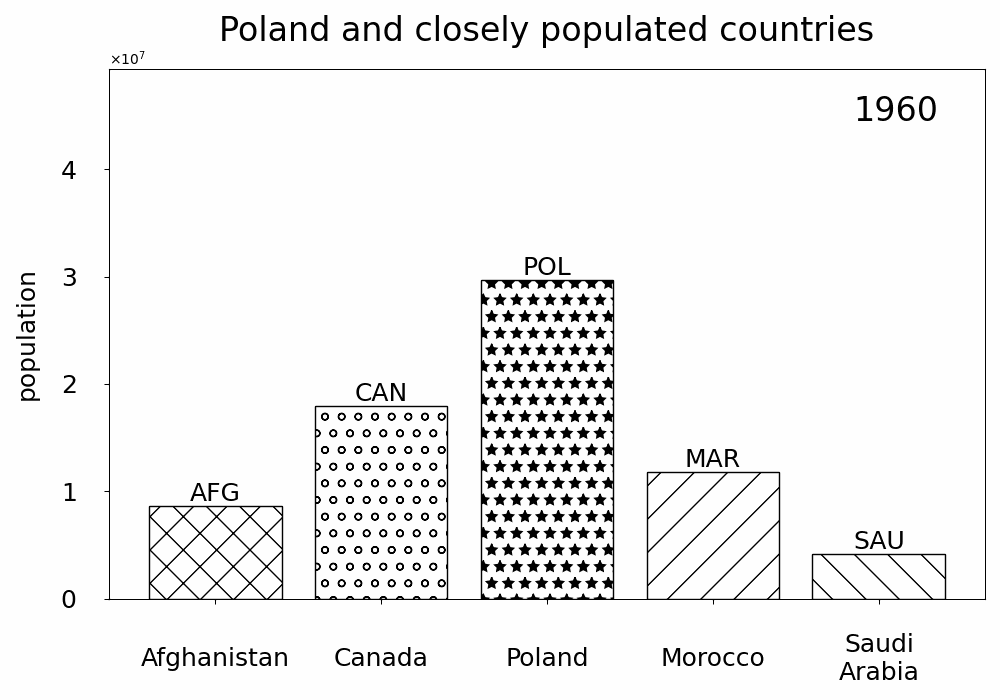

<!-- Line Charts -->

  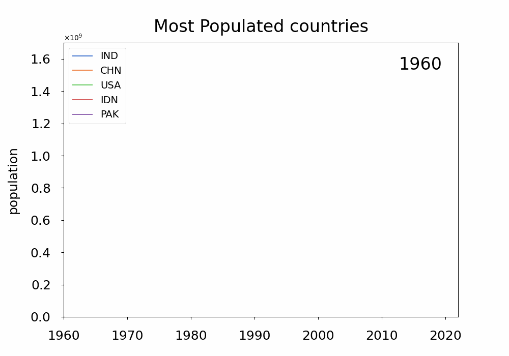
  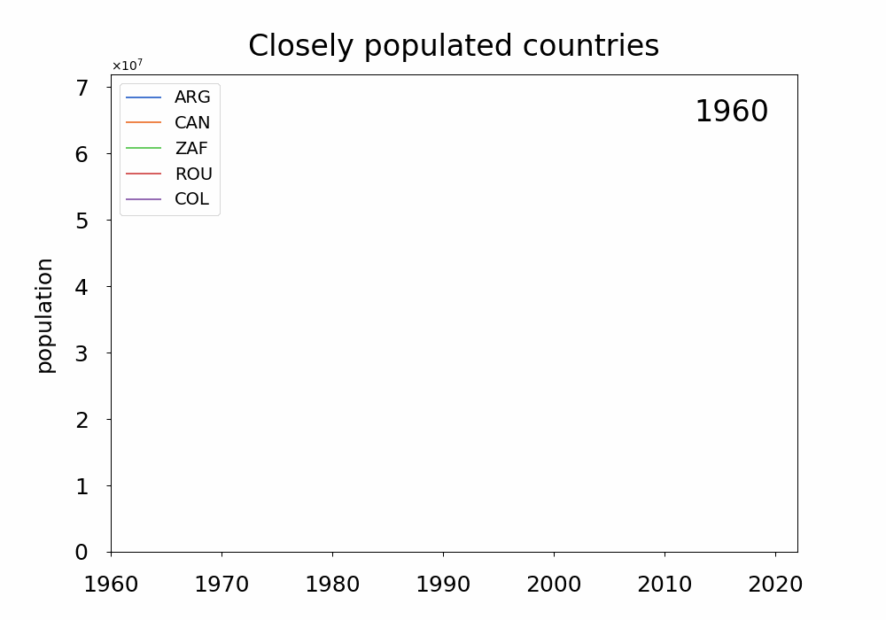
  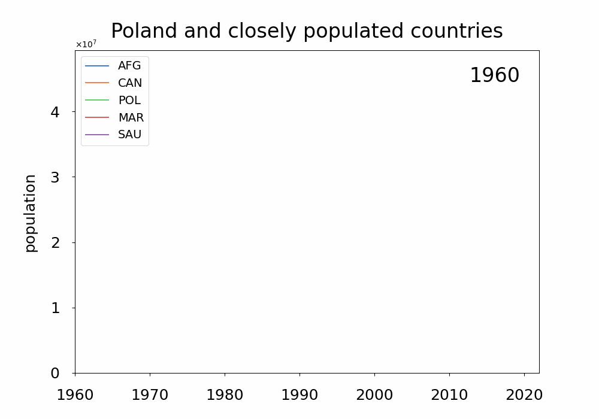

<!-- Bubble Charts -->

  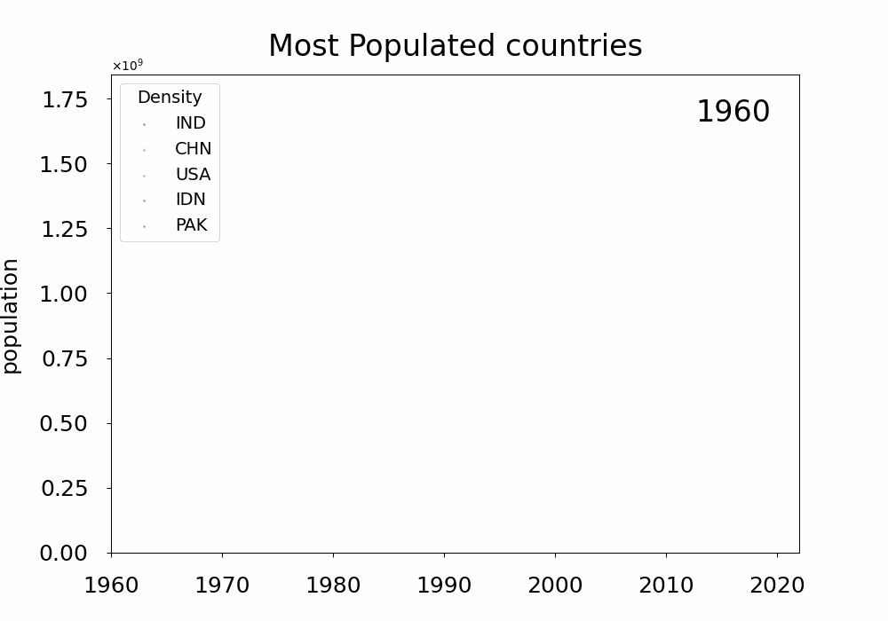
  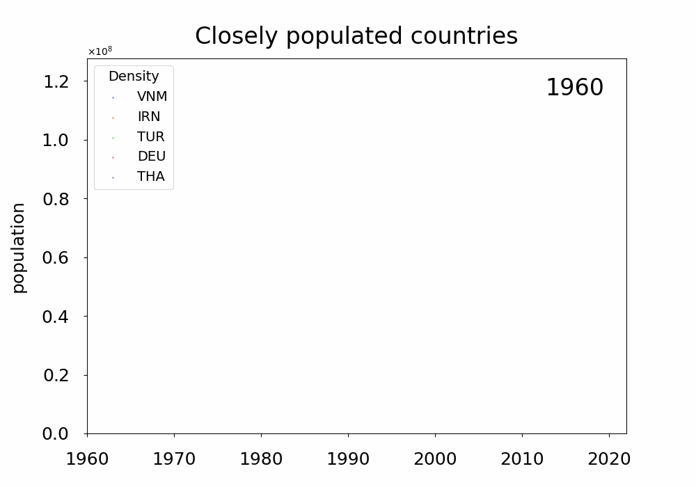
  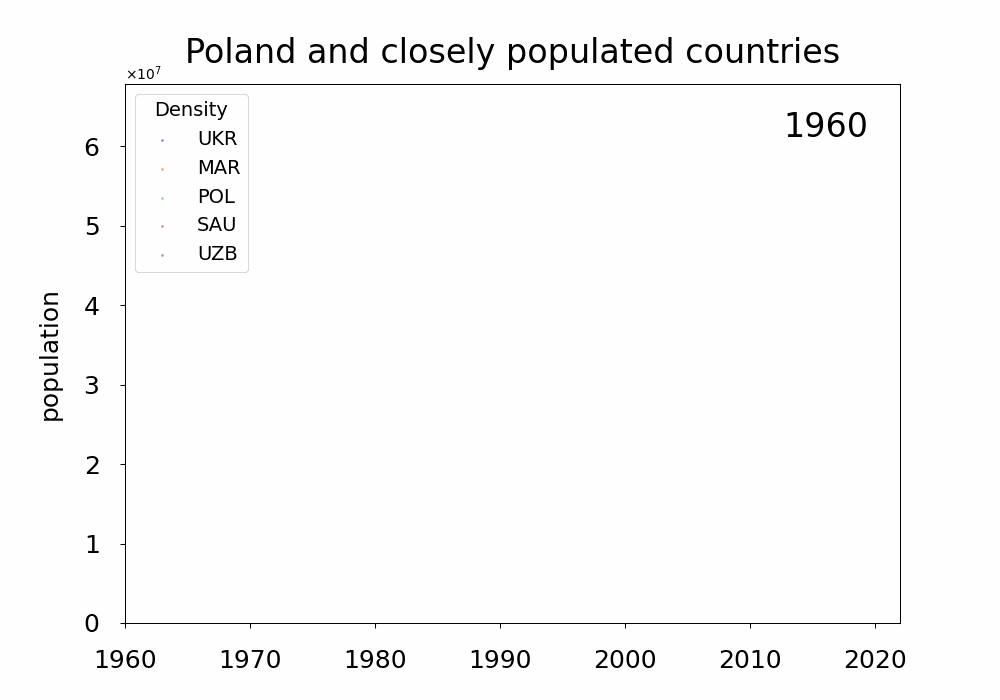

<!-- Pie Charts -->

  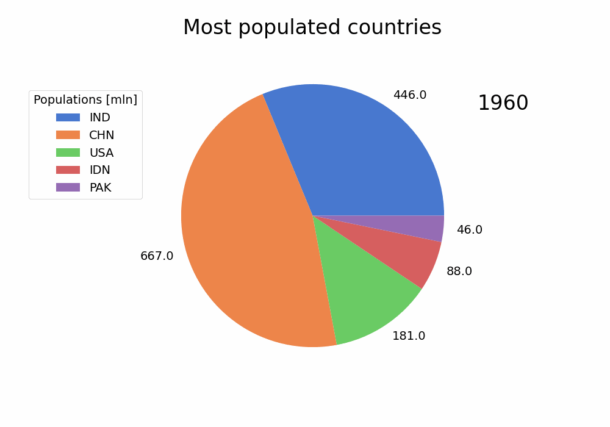
  
  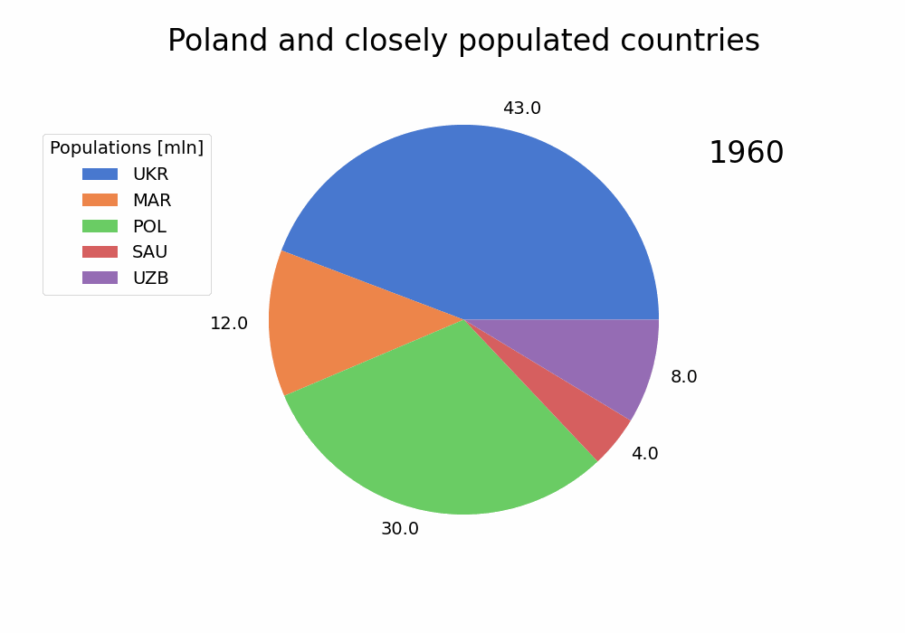

<!-- Change Over Time -->

  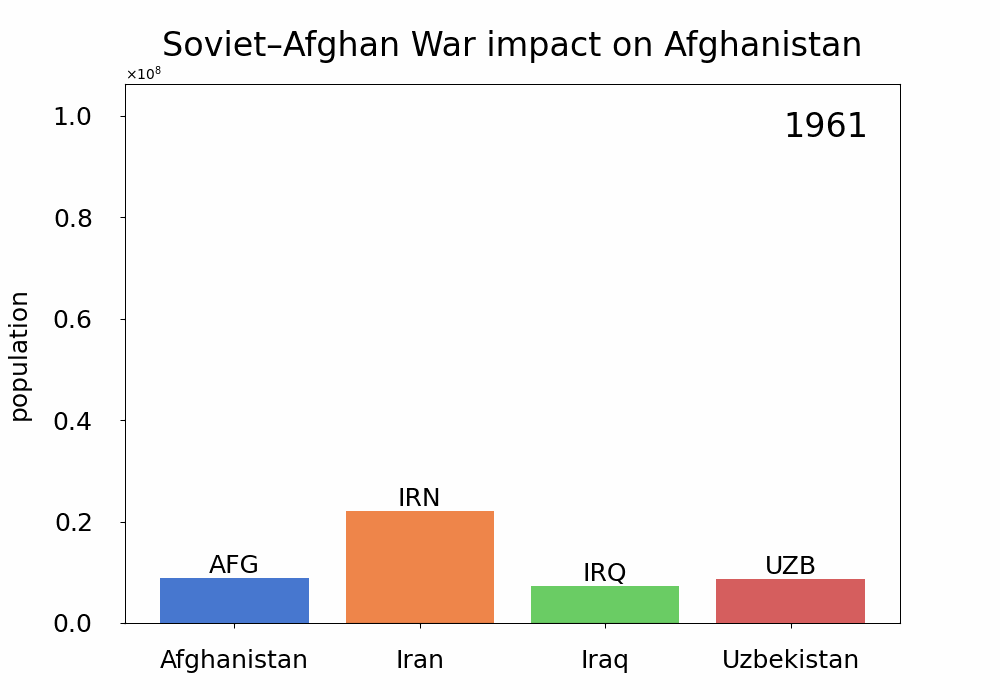

